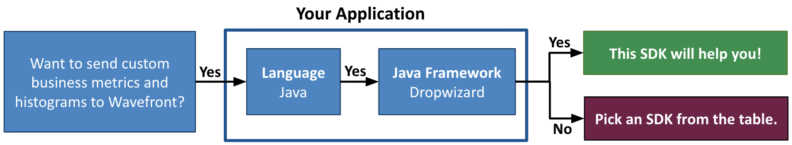

# Wavefront Dropwizard Metrics SDK [![build status][ci-img]][ci] [![Released Version][maven-img]][maven]

## Table of Content
* [Prerequisites](#Prerequisites)
* [Set Up a DropwizardMetricsReporter](#set-up-a-dropwizardmetricsreporter)
  * [Step 1: Create a Builder for a DropwizardMetricsReporter](#step-1-create-a-builder-for-a-dropwizardmetricsreporter)
  * [Step 2: Configure the DropwizardMetricsReporter (Optional)](#step-2-configure-the-dropwizardmetricsreporter-optional)
  * [Step 3: Set Up a WavefrontSender](#step-3-set-up-a-wavefrontsender)
  * [Step 4: Create a DropwizardMetricsReporter](#step-4-create-a-dropwizardmetricsreporter)
* [Start the DropwizardMetricsReporter](#start-the-dropwizardmetricsreporter)
* [Stop the DropwizardMetricsReporter](#stop-the-dropwizardmetricsreporter)
* [Types of Data You Can Report to Wavefront](#types-of-data-you-can-report-to-wavefront)
* [Monitoring the SDK](#monitoring-the-sdk)
* [License](#License)
* [How to Contribute](#How-to-Contribute)

# Welcome to the Wavefront Dropwizard Metrics SDK

The Tanzu Observability by Wavefront Dropwizard Metrics SDK for Java is a library that supports reporting [Dropwizard metrics, delta counters, and histograms](https://metrics.dropwizard.io) to Wavefront.

**Before you start implementing, let us make sure you are using the correct SDK!**



> ***Note***:
> </br>
>   **This is the Tanzu Observability by Wavefront Metrics SDK  for the Java Dropwizard Framework!**
>   If this SDK is not what you were looking for, see the [table](#wavefront-sdks) given below.

#### Wavefront SDKs
<table id="SDKlevels" style="width: 100%">
<tr>
  <th width="10%">SDK Type</th>
  <th width="45%">SDK Description</th>
  <th width="45%">Supported Languages</th>
</tr>

<tr>
  <td><a href="https://docs.wavefront.com/wavefront_sdks.html#sdks-for-collecting-trace-data">OpenTracing SDK</a></td>
  <td align="justify">Implements the OpenTracing specification. Lets you define, collect, and report custom trace data from any part of your application code. <br>Automatically derives Rate Errors Duration (RED) metrics from the reported spans. </td>
  <td>
    <ul>
    <li>
      <b>Java</b>: <a href ="https://github.com/wavefrontHQ/wavefront-opentracing-sdk-java">OpenTracing SDK</a> <b>|</b> <a href ="https://github.com/wavefrontHQ/wavefront-opentracing-bundle-java">Tracing Agent</a>
    </li>
    <li>
      <b>Python</b>: <a href ="https://github.com/wavefrontHQ/wavefront-opentracing-sdk-python">OpenTracing SDK</a>
    </li>
    <li>
      <b>Go</b>: <a href ="https://github.com/wavefrontHQ/wavefront-opentracing-sdk-go">OpenTracing SDK</a>
    </li>
    <li>
      <b>.Net/C#</b>: <a href ="https://github.com/wavefrontHQ/wavefront-opentracing-sdk-csharp">OpenTracing SDK</a>
    </li>
    </ul>
  </td>
</tr>

<tr>
  <td><a href="https://docs.wavefront.com/wavefront_sdks.html#sdks-for-collecting-metrics-and-histograms">Metrics SDK</a></td>
  <td align="justify">Implements a standard metrics library. Lets you define, collect, and report custom business metrics and histograms from any part of your application code.   </td>
  <td>
    <ul>
    <li>
    <b>Java</b>: <a href ="https://github.com/wavefrontHQ/wavefront-dropwizard-metrics-sdk-java">Dropwizard</a> <b>|</b> <a href ="https://github.com/wavefrontHQ/wavefront-runtime-sdk-jvm">JVM</a>
    </li>
    <li>
    <b>Python</b>: <a href ="https://github.com/wavefrontHQ/wavefront-pyformance">Pyformance SDK</a>
    </li>
    <li>
      <b>Go</b>: <a href ="https://github.com/wavefrontHQ/go-metrics-wavefront">Go Metrics SDK</a>
      </li>
    <li>
    <b>.Net/C#</b>: <a href ="https://github.com/wavefrontHQ/wavefront-appmetrics-sdk-csharp">App Metrics SDK</a>
    </li>
    </ul>
  </td>
</tr>

<tr>
  <td>Framework SDK</td>
  <td align="justify">Reports predefined traces, metrics, and histograms from the APIs of a supported app framework. Lets you get started quickly with minimal code changes.</td>
  <td>
    <ul>
    <li><b>Java</b>:
    <a href="https://github.com/wavefrontHQ/wavefront-dropwizard-sdk-java">Dropwizard</a> <b>|</b> <a href="https://github.com/wavefrontHQ/wavefront-gRPC-sdk-java">gRPC</a> <b>|</b> <a href="https://github.com/wavefrontHQ/wavefront-jaxrs-sdk-java">JAX-RS</a> <b>|</b> <a href="https://github.com/wavefrontHQ/wavefront-jersey-sdk-java">Jersey</a></li>
    <li><b>.Net/C#</b>:
    <a href="https://github.com/wavefrontHQ/wavefront-aspnetcore-sdk-csharp">ASP.Net core</a> </li>
    <!--- [Python](wavefront_sdks_python.html#python-sdks-that-instrument-frameworks) --->
    </ul>
  </td>
</tr>

<tr>
  <td><a href="https://docs.wavefront.com/wavefront_sdks.html#sdks-for-sending-raw-data-to-wavefront">Sender SDK</a></td>
  <td align="justify">Lets you send raw values to Wavefront for storage as metrics, histograms, or traces, e.g., to import CSV data into Wavefront.
  </td>
  <td>
    <ul>
    <li>
    <b>Java</b>: <a href ="https://github.com/wavefrontHQ/wavefront-sdk-java">Sender SDK</a>
    </li>
    <li>
    <b>Python</b>: <a href ="https://github.com/wavefrontHQ/wavefront-sdk-python">Sender SDK</a>
    </li>
    <li>
    <b>Go</b>: <a href ="https://github.com/wavefrontHQ/wavefront-sdk-go">Sender SDK</a>
    </li>
    <li>
    <b>.Net/C#</b>: <a href ="https://github.com/wavefrontHQ/wavefront-sdk-csharp">Sender SDK</a>
    </li>
    <li>
    <b>C++</b>: <a href ="https://github.com/wavefrontHQ/wavefront-sdk-cpp">Sender SDK</a>
    </li>
    </ul>
  </td>
</tr>

</tbody>
</table>

## Prerequisites
If you are using Maven, add the following maven dependency to your `pom.xml` file:
```
<dependency>
    <groupId>com.wavefront</groupId>
    <artifactId>wavefront-dropwizard-metrics-sdk-java</artifactId>
    <version>$releaseVersion</version>
</dependency>
```
Replace `$releaseVersion` with the latest version available on [maven](http://search.maven.org/#search%7Cga%7C1%7Cwavefront-dropwizard-metrics-sdk-java).

## Set Up a DropwizardMetricsReporter

This SDK provides a `DropwizardMetricsReporter` to report metrics and histograms to Wavefront.

To create a `DropwizardMetricsReporter`, follow these steps:
1. Create a `DropwizardMetricsReporter.Builder` instance.
2. Optionally, use the builder to configure the `DropwizardMetricsReporter`.
3. Create a `WavefrontSender` to send data to Wavefront.
4. Use the builder to create a `DropwizardMetricsReporter` with the `WavefrontSender`.

For details of each step, see the sections below.

### Step 1: Create a Builder for a DropwizardMetricsReporter

The `DropwizardMetricsReporter` object reports any metrics, delta counters, and histograms you register in a `MetricRegistry`. This step creates a builder that supports configuring the metrics reporter.

```java
// Create a registry
MetricRegistry metricRegistry = new MetricRegistry();

// Create a builder instance for the registry
DropwizardMetricsReporter.Builder builder = DropwizardMetricsReporter.forRegistry(metricRegistry);
```

### Step 2: Configure the DropwizardMetricsReporter (Optional)

You can use the `DropwizardMetricsReporter` builder to specify various optional properties.

#### Basic Properties

```java
// Optional: Set a nondefault source for your metrics, delta counters, and histograms.
// Defaults to hostname if omitted
builder.withSource("mySource");

// Add individual reporter-level point tags for your metrics, delta counters, and histograms
// The point tags are sent with every metric and histogram reported to Wavefront.
builder.withReporterPointTag("env", "staging");  // Example - replace values!
builder.withReporterPointTag("location", "SF");  // Example - replace values!

// Optional: Add application tags, which are propagated as point tags with the reported metric.
// See https://github.com/wavefrontHQ/wavefront-sdk-java/blob/master/docs/apptags.md for details.
builder.withApplicationTags(new ApplicationTags.Builder("OrderingApp", "Inventory").
       cluster("us-west-1").
       shard("primary").build());   // Example - replace values!

// Optional: Report your metrics, delta counters, and histograms with the specified prefix.
builder.prefixedWith("myPrefix");   // Example - replace value!

// Optional: Report JVM metrics for your Java application.
builder.withJvmMetrics();

// Optional: Report minute bin Wavefront histograms.
builder.reportMinuteDistribution();

// Optional: Report hour bin Wavefront histograms.
builder.reportHourDistribution();

// Optional: Report day bin Wavefront histograms.
builder.reportDayDistribution();
```

#### Advanced Properties
```java
// Optional: Explicitly set the clock to override default behavior
builder.withClock(new Clock() {
  @Override
  public long getTick() {
    return System.currentTimeMillis();
  }
});

// Optional: Set a filter to report metrics only if they begin with 'my*'
builder.filter(MetricFilter.startsWith("my"));

// Optional: Don't report stddev and m15
builder.disabledMetricAttributes(ImmutableSet.<MetricAttribute>builder().
    add(MetricAttribute.STDDEV).
    add(MetricAttribute.M15_RATE).
    build());
```

### Step 3: Set Up a WavefrontSender
The `WavefrontSender` object implements the low-level interface to send data to Wavefront. 

* If you have already set up a `WavefrontSender` for another SDK that runs in the same Java Virtual Machine (JVM), use that one. For details about sharing a `WavefrontSender` instance, see [Share a WavefrontSender](https://github.com/wavefrontHQ/wavefront-sdk-doc-sources/blob/master/java/wavefrontsender.md#Share-a-WavefrontSender).

* Otherwise, follow the steps in [Set Up a WavefrontSender](https://github.com/wavefrontHQ/wavefront-sdk-doc-sources/blob/master/java/wavefrontsender.md#wavefrontsender) to send data using either the [Wavefront proxy](https://docs.wavefront.com/proxies.html) or [direct ingestion](https://docs.wavefront.com/direct_ingestion.html).


### Step 4: Create a DropwizardMetricsReporter
Use the configured builder to create the `DropwizardMetricsReporter`. You must first specify the `WavefrontSender` object (see above).

```java
// Create a DropwizardMetricsReporter instance
WavefrontSender wavefrontSender = buildWavefrontSender(); // pseudocode
DropwizardMetricsReporter dropwizardMetricsReporter = builder.build(wavefrontSender);
```
## Start the DropwizardMetricsReporter

You need to explicitly start the `DropwizardMetricsReporter` to start reporting any metrics, delta counters, or histograms you create. Reporting continues until you stop the `DropwizardMetricsReporter` (see below).

The `DropwizardMetricsReporter` reports metrics/delta counters/histograms at regular intervals. Specify the length of the reporting interval to control how often you send data to the `WavefrontSender`. The reporting interval determines the timestamps on the data sent to Wavefront.

```java
// Start the reporter to report metrics/delta counters/histograms at regular interval (example: 30s)
dropwizardMetricsReporter.start(30, TimeUnit.SECONDS);
```

## Stop the DropwizardMetricsReporter
You must explicitly stop the `DropwizardMetricsReporter` before shutting down your application.

```java
// Get total failure count reported by this reporter
int totalFailures = dropwizardMetricsReporter.getFailureCount();

// stop the reporter
dropwizardMetricsReporter.stop();
```

## Types of Data You Can Report to Wavefront
The Dropwizard metrics library supports various [metric types](https://metrics.dropwizard.io/4.0.0/manual/core.html). This Wavefront SDK additionally provides a
[`DeltaCounter`](https://docs.wavefront.com/delta_counters.html) type and a [`WavefrontHistogram`](https://docs.wavefront.com/proxies_histograms.html) type.

After you have created and started the `DropwizardMetricsReporter`, the metrics/delta counters/histograms you create are automatically reported to Wavefront.

```java
// Assume a DropwizardMetricsReporter that is configured with the filter shown in Advanced Properties, above.

// Raw Counters
// Counter name begins with 'my*', so it's reported.
Counter counter = metricRegistry.counter("myCounter");
// Counter name does not begin with 'my*', so it's ignored.
Counter notReported = metricRegistry.counter("notMyCounter");

// Wavefront Delta Counter
DeltaCounter deltaCounter = DeltaCounter.get(metricRegistry, "myDeltaCounter");

// Gauge
AtomicInteger bufferSize = new AtomicInteger();
Gauge gauge = metricRegistry.register("myGauge", () -> bufferSize.get());

// Meter
Meter meter = metricRegistry.meter("myMeter");

// Timer
Timer timer = metricRegistry.timer("myTimer");

// Default Dropwizard Histogram
Histogram dropwizardHistogram = metricRegistry.histogram("myDropwizardHistogram");

// WavefrontHistogram
WavefrontHistogram wavefrontHistogram = WavefrontHistogram.get(metricRegistry, "myWavefrontHistogram");
```

## Monitoring the SDK
See the [diagnostic metrics documentation](https://github.com/wavefrontHQ/wavefront-dropwizard-metrics-sdk-java/tree/master/docs/internal_metrics.md) for details on the internal metrics that this SDK collects and reports to Wavefront.

## License
[Apache 2.0 License](LICENSE).

## How to Contribute

* Reach out to us on our public [Slack channel](https://www.wavefront.com/join-public-slack).
* If you run into any issues, let us know by creating a GitHub issue.
* If you didn't find the information you are looking for in our Wavefront Documentation, create a GitHub issue or PR.

[ci-img]: https://travis-ci.com/wavefrontHQ/wavefront-dropwizard-metrics-sdk-java.svg?branch=master
[ci]: https://travis-ci.com/wavefrontHQ/wavefront-dropwizard-metrics-sdk-java
[maven-img]: https://img.shields.io/maven-central/v/com.wavefront/wavefront-dropwizard-metrics-sdk-java.svg?maxAge=604800
[maven]: http://search.maven.org/#search%7Cga%7C1%7Cwavefront-dropwizard-metrics-sdk-java
